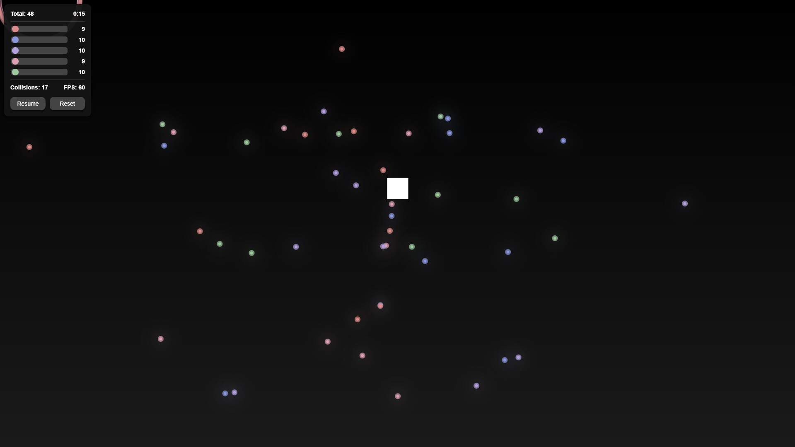

# Particle Simulation

## About This Project

This is my **First ever Coding Project!**

### My Dev Journey

When I first started this project, I had zero coding experience and did not even understand what an html file was. I doubted myself constantly. I used AI to create this, and at first, it felt like I was cheating. But here's what I learned: **everyone starts somewhere**

A friend inspired me to try something new, and that push was all I needed to begin to overcome what felt impossible.

### To Anyone Reading This

Your first project doesn't need to be perfect.

- Keep building
- Celebrate the small wins
- Don't let self-doubt stop you

Build something. Break it. Fix it. Learn. Grow.

**You've got this.**

---

## Features

- **Interactive Particle System**: Control up to 500 particles across 5 beautiful color variants (Red, Blue, Lavender, Rose, Sage)
- **Physics Simulation**: Particles attract each other, collide with boundaries, and interact with a controllable square
- **Dynamic Controls**: Adjust particle counts in real-time with intuitive sliders
- **Collision Detection**: Watch particles bounce, explode, and create stunning visual effects
- **Performance Tracking**: Real-time FPS counter and collision statistics
- **Dark Theme**: Modern, minimalistic dark mode interface
- **Keyboard Controls**: Use WASD keys to control the white square and watch particles react

## How to Use

1. Open `index.html` in your web browser or click the link provided by gitpages at the top of this repo
2. Use the sliders on the left to adjust the number of particles for each color
3. Use **WASD** keys to move the white square around

## Technical Details

- Built with vanilla JavaScript (no frameworks!)
- HTML5 Canvas for rendering
- Real-time physics calculations
- Responsive design that adapts to window size
